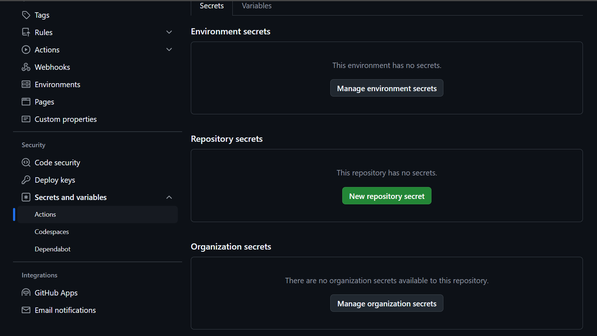

## Priprema backenda za deploy na Render:

- po potrebi dodati env. varijable u run konfiguraciju vašeg IDE-a
- dodati Dockerfile
- preporuča se u [application.properties](src/main/resources/application.properties) postaviti property
  server.servlet.context-path na /api, tako da svi zahtjevi na backend imaju /api prefiks
- ako želite koristiti Liquibase za populiranje baze dodajte njegov dependency u pom.xml
  i [changelogove](src/main/resources/db/changelog) u resources
- (ako je potrebno) u application.properties dodati željene env. varijable u formatu:
  some.property=${ENV_VAR_NAME:default value}
    - [primjer u ovome repozitoriju](backend/src/main/resources/application.properties)
- (opcionalno, ali preporučeno) u pom.xml kao dependency dodati spring-boot-starter-actuator (prema primjeru u ovom
  repozitoriju) koji će na putanju /actuator/health automatski izložiti informaciju o statusu aplikacije koju može
  koristiti Render. Ovo zovemo _health check_.

## Priprema frontenda za deploy na Render:

- u frontendu namjestiti [vite.config.js](frontend/vite.config.js) koji služi kao proxy server za lokalni razvoj
  (redirecta /api pozive na localhost:8080/api kad se pokreće dev skriptom)
    - pošto smo postavili server.servlet.context-path na /api treba ukloniti `rewrite:` liniju koja je u primjeru s
      frontend predavanja!
- dodati Dockerfile
- dodati nginx.conf, u kojem se nalaze postavke za produkcijski reverse-proxy za backend te posluživanje buildanog
  frontenda
    - korištenje proxya omogućuje da se pozivi na backend izvršavaju prema frontend URL-u jednostavnim pozivom /api
      endpointa

## Postavljanje build i deploy procesa:

GitHub free account ima pristup 2000 besplatnih pipeline minuta mjesečno, što je razlog zašto koristimo GitHub Actions
umjesto Renderovog build procesa.
GitHub također besplatno pruža do 500 MB pohrane Docker image-a, što ćemo također koristiti za deploy.

### Dozvole za izvođenje actionsa

GitHub repozitorij kreirali ste na jedan od dva načina: kreiranjem unutar organizacije (kao na primjer
_progi-devops_ unutar koje se nalazi ovaj repozitorij) ili kreiranjem repozitorija unutar putanje vašeg GitHub
korisničkog imena. Deploy proces bi trebao funkcionirati jednako, no potrebno je u postavkama repozitorija
omogućiti write pristup od strane GitHub Actionsa, kako bi mogao stvoriti Docker image.

- Ako koristite organizaciju, na razini organizacije (ne repozitorija):
    - otvoriti tab postavke (potreban je admin pristup)
    - ići do Actions -> General
      
    - Workflow permissions prebaciti na _Read and write permissions_ i stisnuti save.
      

- Ako je repozitorij kreiran pod vašim ili nečijim korisničkim imenom, postavke se nalaze na istom mjestu, ali u
  postavkama repozitorija.

### Dodavanje pipelineova (GitHub actions)

Pipeline skripte se nalaze u repozitoriju u [.github/workflows](.github/workflows) direktoriju. Ako ih želite koristiti
u vlastitom repozitoriju, commitajte ih na main branch.

Prema postavkama u skriptama build se automatski pokreće prilikom pusha na main, no može se aktivirati i ručno kroz
Actions tab -> odabrati workflow koji želite pokrenuti -> Run workflow. U ručnom izvođenju deploy možete pokrenuti i sa
nekog drugog brancha.

**Prije nastavka workflowe za build frontenda i backenda svaki treba pokrenuti barem jednom.** To znači da prije deploya
aplikacije na Render vaš build pipeline mora ispravno raditi.

## Deploy:

### Baza podataka:

U free planu Rendera PostgreSQL baza se automatski briše nakon 30 dana, pa se preporuča korištenje H2 baze (koja gubi
podatke svakim restartom) te zatim prelazak na PostgreSQL par tjedana prije finalne demonstracije. Alternativno možete
rekreirati bazu svakih 30 dana. Zbog gubitka podataka H2 baze sve podatke potrebne za development morat ćete ubaciti
u skripte za inicijalizaciju baze. Kreiranje PostgreSQL baze na Render dashboardu (preskočite ako vam je ok koristiti H2):
- New -> PostgreSQL
- Postaviti ime baze i opcionalno username za korisnika baze (password je automatski generiran)
- Region Frankfurt
- Create Database
- Free plan baza podataka ima max. pohranu od 1GB, te se baza briše nakon 30 dana.

### Kreiranje backenda:

U Render dashboardu:

- New -> Web Service
- Source Code postaviti na existing image
- U image URL zalijepiti putanju image-a u vašem repozitoriju i stisnuti connect (struktura je
  `ghcr.io/putanja-do-repozitorija/backend:latest`), u slučaju ovog repozitorija to je
  `ghcr.io/progi-devops/progi-monorepo/backend:latest`
  
- Postaviti ime za servis (postat će dio web adrese)
- Region Frankfurt
- Instance type Free (default je Starter koji se plaća)
- Dodati potrebne environment varijable
    - Ako želite koristiti PostgreSQL bazu, potrebno je kopirati vrijednosti iz postavki baze podataka na Renderu.
      U [application-postgres.properties](backend/src/main/resources/application-postgres.properties) imate imena
      environment varijabli koje vam trebaju.
      Pripaziti jer URL koji je prikazan na Renderu nije JDBC URL, za ovaj primjer treba
      biti u formatu `jdbc:postgresql://hostname:port/database`
    - Da bismo backendu naznačili da koristimo PostgreSQL treba dodati varijablu `SPRING_PROFILES_ACTIVE` s vrijednošću
      `postgres`
- Na dnu proširiti _advanced_
- Ako je dodan Spring Boot Actuator (prema zadnjoj točki poglavlja pripreme za deploy) postaviti
  `/api/actuator/health` kao Health Check Path (odnosno <context-path>/actuator/health)
- Stisnuti Create Web Service

- Kako bismo ubuduće Renderu mogli signalizirati da je novi build dostupan te da je potreban redeploy, postavit ćemo
  webhook kojeg će automatski pozivati GitHub pipeline:
    - U postavkama backend servisa na Renderu otvoriti settings i kopirati Deploy hook vrijednost
      
    - Otvoriti settings tab GitHub repozitorija -> Secrets and variables -> Actions -> New repository secret
      
    - Kao ime secreta postaviti BACKEND_DEPLOY_HOOK, a u vrijednost zalijepiti kopirani hook URL i kliknuti Add secret
    - Pipeline je bio konfiguriran da ignorira korak koji zove taj hook URL ako ovaj secret nije postavljen, sad će
      svakim
      sljedećim izvođenjem pipelinea automatski okinuti deploy nove verzije na Renderu. Istu stvar ponovit ćemo i za
      frontend.

### Kreiranje frontenda:

U Render dashboardu:

- New -> Web Service
- U image URL zalijepiti putanju image-a u vašem repozitoriju i stisnuti connect (struktura je
  `ghcr.io/putanja-do-repozitorija/frontend:latest`), u slučaju ovog repozitorija to je
  `ghcr.io/progi-devops/progi-monorepo/frontend:latest`
- Postaviti ime za servis (postat će dio web adrese vašeg frontenda)
- Region Frankfurt
- Instance type Free
- Dodati potrebne environment varijable - BACKEND_URL postaviti na adresu deployanog backenda aplikacije dostupnu na
  Render dashboardu
- Stisnuti Create Web Service

- Kao i za backend, konfiguriramo deploy webhook:
    - U postavkama frontend servisa na Renderu otvoriti settings i kopirati Deploy hook vrijednost
    - Otvoriti settings tab GitHub repozitorija -> Secrets and variables -> Actions -> New repository secret
    - Kao ime secreta postaviti FRONTEND_DEPLOY_HOOK, a u vrijednost zalijepiti kopirani hook URL, te kliknuti Add
      secret

Napomena: nakon perioda neaktivnosti od 15 min aplikacije na Renderu bit će automatski ugašene, te ponovno podignute pri
zaprimanju zatjeva (otvaranje web stranice frontenda ili slanje zahtjeva na API) i kao takve neće biti dostupne dok se
ne podignu sto može trajati nekoliko minuta.

**Ako želite ubrzati podizanje aplikacija, pokrenite GitHub Action naziva
_Trigger Render restart_, koji će pozvati redeploy hookove oba servisa.**

## Migracija s H2 na PostgreSQL

Prije predaje možda ćete htjeti koristiti aplikaciju i ne gubiti podatke, ovako migrirate na PostgreSQL:

Kreiranje baze u Renderu:
- New -> PostgreSQL
- Postaviti ime baze i opcionalno username za korisnika baze (password je automatski generiran)
- Region Frankfurt
- Create Database
- Free plan baza podataka ima max. pohranu od 1GB, te se baza briše nakon 30 dana.

- U postavke backend servisa na Renderu dodati potrebne environment varijable
  - kopirati vrijednosti iz postavki baze podataka na Renderu:
    - `DB_URL = jdbc:postgresql://hostname:port/database` (obavezno u ovom formatu, zamijeniti hostname, port i database 
      s odgovarajućim vrijednostima)
    - `DB_USERNAME`
    - `DB_PASS`
  - za postaviti profil `SPRING_PROFILES_ACTIVE = postgres`
- spremite promjene na servisu
